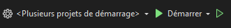

# projet-gestion

## 🌟 Overview

**projet-gestion** is a desktop application for managing the inventory of a wholesaler. It allows managing products, categories, customers, and orders. It also features a dashboard on the homepage to display sales and stock statistics.

## 🚀 Features

- **🔐 Authentication**: User login and logout.
- **📊 Dashboard**:
  - 🏆 Best-selling product
  - 💰 Total sales amount
  - 📈 Chart: Top 3 best-selling products
  - 🔔 Notification of products soon out of stock (< 5 units)
- **📦 Product management**: Add, modify, delete, and display products.
- **🗂️ Category management**: Add, modify, delete, and display categories.
- **👥 Customer management**: Add, modify, delete, and display customers.
- **🛒 Order management**: Add, modify, delete, and display orders.
- **📑 Export**: Export datas inside CSV or JSON file.

## 🛠️ Prerequisites

- **.NET SDK**
- **Visual Studio**

## 📚 Installation

1. Clone the repository:

```bash
git clone https://github.com/vincmgn/projet-gestion.git
```

2. Install the dependencies:

```bash
cd projet-gestion
dotnet restore
```

3. Apply the migration:

```bash
dotnet ef database update
```

4. Run the application:



Click on the "Démarrer" button in Visual Studio.

## 🗄️ Technical Constraints

| Frontend | Backend               |
| -------- | --------------------- |
| C# (WPF) | C# (ASP.NET)          |
| XAML     | SQLite                |
|          | Entity Framework Core |
